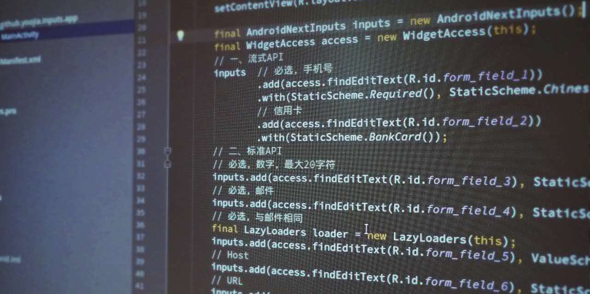

# 项目结构



- `inputs` Inputs校验核心模块，实现校验库的整体架构；见: [Inputs](./inputs/README.md)
- `android` Android 外壳模块，针对Android平台的组件访问做支持；

# NextInputs

Inputs校验核心模块，实现校验库的整体架构；

更详细文档，见: [Inputs](./inputs/README.md)

# 使用示例

```java
final AndroidNextInputs inputs = new AndroidNextInputs();
// Inputs会保存各个规则，如果Inputs被Activity缓存，onCreate会多次调用。需要注意清除。
inputs.clear();

final WidgetAccess access = new WidgetAccess(this);
// 一、流式API
inputs  // 必选，手机号
        .add(access.findEditText(R.id.form_field_1))
        .with(StaticScheme.Required(), StaticScheme.ChineseMobile())
        // 信用卡
        .add(access.findEditText(R.id.form_field_2))
        .with(StaticScheme.BankCard());
// 二、标准API
// 必选，数字，最大20字符
inputs.add(access.findEditText(R.id.form_field_3), StaticScheme.Required(), StaticScheme.Digits(), ValueScheme.MaxLength(20));
// 必选，邮件
inputs.add(access.findEditText(R.id.form_field_4), StaticScheme.Required(), StaticScheme.Email());
// 必选，与邮件相同
final LazyLoaders loader = new LazyLoaders(this);
inputs.add(access.findEditText(R.id.form_field_5), ValueScheme.Required(), ValueScheme.EqualsTo(loader.fromEditText(R.id.form_field_4)));
// Host
inputs.add(access.findEditText(R.id.form_field_6), StaticScheme.Host());
// URL
inputs.add(access.findEditText(R.id.form_field_6), StaticScheme.URL());
// MaxLength
inputs.add(access.findEditText(R.id.form_field_7), ValueScheme.MaxLength(5));
// MinLength
inputs.add(access.findEditText(R.id.form_field_8), ValueScheme.MinLength(4));
// RangeLength
inputs.add(access.findEditText(R.id.form_field_9), ValueScheme.RangeLength(4, 8));
// Not Blank
inputs.add(access.findEditText(R.id.form_field_10), StaticScheme.NotBlank());
// Numeric
inputs.add(access.findEditText(R.id.form_field_11), StaticScheme.Numeric());
// MaxValue
inputs.add(access.findEditText(R.id.form_field_12), ValueScheme.MaxValue(100));
// MinValue
inputs.add(access.findEditText(R.id.form_field_13), ValueScheme.MinValue(20));
// RangeValue
inputs.add(access.findEditText(R.id.form_field_14), ValueScheme.RangeValue(18, 30));

// 自定义校验规则
// 1. 跟上面一样，指定需要校验的View；
// 2. 通过Scheme.create方法，创建Verifier校验器，校验器实现具体的校验规则；
inputs.add(access.findTextView(R.id.form_field_14), Scheme.create(new Verifier() {
    @Override
    public boolean perform(String rawInput) throws Exception {
        return "对输入内容进行自定义规则校验".equals(rawInput);
    }
}));

```

# Android扩展

### AndroidMessageDisplay

`AndroidNextInputs` 增加了Android支持，默认使用的AndroidMessageDisplay实现了Android内置组件的错误展示功能 ：使用TextView.setError()和Toast来展示校验失败的消息。

### WidgetAccess

`WidgetAccess` 是一个为Android创建的扩展工具类，用于读取输入组件的数据，通过它可以快捷地读取布局文件中的EditText等组件及其数据。

- findXXX 等方法可用于快速查找各类型的View；
- getXXX 等方法可快速读取各类型View的数值；

### LazyLoaders

`LazyLoaders` 是一个为Android创建的扩展工具类，用于延迟加载组件数据，通过它可以快捷地添加基于Android输入组件的延迟加载器。

----

# JCenter 支持

本项目的库文件托管在JCenter上，注意添加JCenter的仓库：

```groovy
repositories {
    jcenter()
}
```

# 配置 Gradle 依赖

```groovy
dependencies {
    compile 'com.github.yoojia:next-inputs-android:1.7.0-BETA'
}
```

其它版本：

```groovy
dependencies {
    compile 'com.github.yoojia:next-inputs-android:1.7.0-BETA'
}
```

----

# 问题与交流

关于本项目你有任何问题，可以加微信与我联系（抱歉，没有QQ群）：


# Change Log

### 1.7.1 - 2017/01/05

- 增加Schema.create创建自定义校验规则的接口；
- 更新说明文档

### 1.7.0 - 2017/09/27

- 增加字母校验规则 letters;
- 增加数字和字母校验规则 digitLetters;
- 增加Trim处理;
- 更新Scheme接口命名为小写;

### 1.6 - 2017/08/16

- 合并NextInput项目到本项目中；
- 更新工信部新号段166,198,199的校验支持；

### 1.5 - 2017/05/25

- 更新NextInputs版本为1.8.1；
- 移除AndroidInputs类；
- 移除InputsAccess类；

### 2016/12/16 - 1.4

- 更新NextInputs版本为1.8；
- 修正BankCard拼写错误；
- AndroidInputs 标记为@Deprecated，使用 WidgetProviders 来替代；
- InputsAccess 标记为@Deprecated，使用 WidgetAccess 来替代；

### 1.3.3

- 更新NextInputs版本

### 1.3.2

- 增加remove(View)方法，移除View关联的校验规则；

### 1.3

- AndroidNextInputs 增加add(...)方法，可直接添加Android组件和Scheme

### 1.2.8

- 更新NextInputs版本

### 1.2.3

- NextInputs 更新为1.3.2 版本；
- 原来Inputs更新为AndroidInputs；

### 1.2.2

- Bugs fixes

### 1.2.1

- NextInputs 更新为 1.3 版本，移除Fluent，使用NextInputs的Fluent来实现流式API；
- LazyLoaders 增加 fromEditText(EditText) 和 fromTextView(TextView) 方法；

### 1.2

- AndroidNextInputs增加流式API支持，可用 on(...).with(...) 链式调用来设置校验目标和规则；
- InputsFinder 更新为 InputsAccess ；
- InputsAccess 增加 getInt / getLong / getFloat / getDouble等方法；

### 1.1

- TextLoader 修改为 TextLazyLoader
- FormInput 更改为 InputsFinder
- FormLoader 更改为 LazyLoaders

----

# License

    Copyright 2015-2016 Yoojia Chen

    Licensed under the Apache License, Version 2.0 (the "License");
    you may not use this file except in compliance with the License.
    You may obtain a copy of the License at

       http://www.apache.org/licenses/LICENSE-2.0

    Unless required by applicable law or agreed to in writing, software
    distributed under the License is distributed on an "AS IS" BASIS,
    WITHOUT WARRANTIES OR CONDITIONS OF ANY KIND, either express or implied.
    See the License for the specific language governing permissions and
    limitations under the License.

